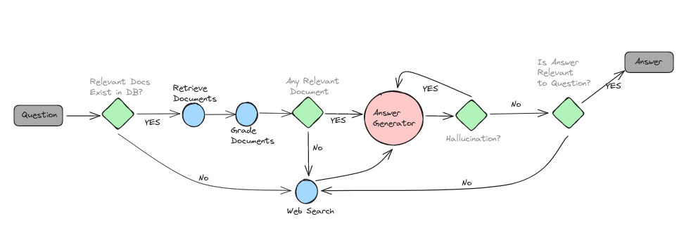

# Improved RAG Techniques

## Papers
- [Corrective RAG](https://arxiv.org/pdf/2401.15884.pdf)
- [Adaptive RAG](https://arxiv.org/abs/2403.14403)
- [Self RAG](https://arxiv.org/abs/2310.11511)

## Code
Heavily influenced by [Mistral Cookbook](https://github.com/mistralai/cookbook/tree/main/third_party/langchain)

## Workflow

## Environment Setup

- Make a copy of the `.env.template` file and rename it to `.env`.

- Open the `.env` file and fill in the details for each placeholder.
